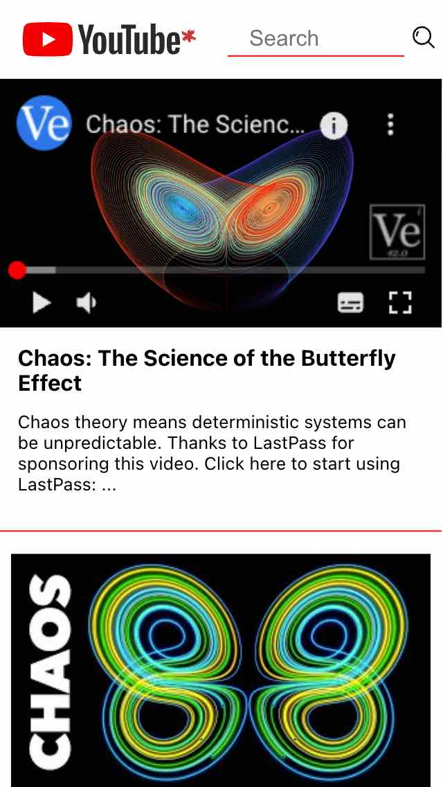
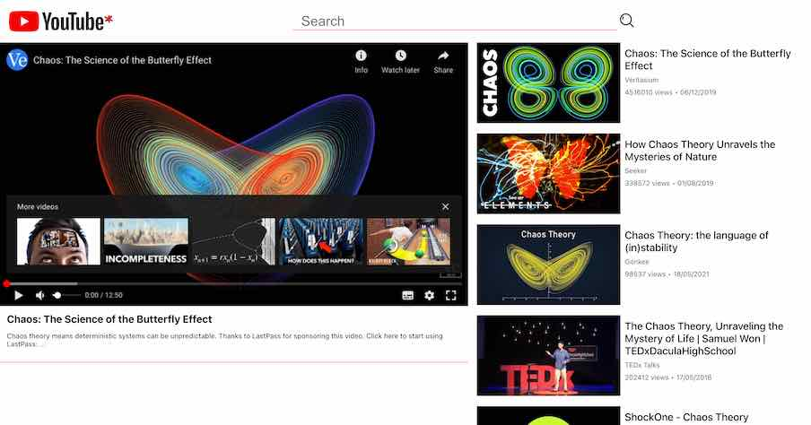

# Youtube Custom Player (React.js Web App)

The app allows users to search for Youtube videos and watch the results in the app's video player.

> Please bear in mind that in order to run this code on your local machine (with the search functionality working) you need to **provide your own API key** in the .env file in the root folder.
> 
>You may get the key for free from [Google Cloud Platform](https://console.cloud.google.com/apis)
>

## Details:
### Tooling
- React Redux
- Redux Toolkit
- Axios
- Jest
- React Testing Library
- SASS
- CSS Modules
- ESLint
- Prettier

This project was bootstrapped with [Create React App](https://github.com/facebook/create-react-app).

## Available Scripts:

In the project directory, you can run:

### `yarn start`

Runs the app in the development mode.\
Open [http://localhost:3000](http://localhost:3000) to view it in the browser.

The page will reload if you make edits.\
You will also see any lint errors in the console.

### `yarn test`

Launches the test runner in the interactive watch mode.\
See the section about [running tests](https://facebook.github.io/create-react-app/docs/running-tests) for more information.

### `yarn build`

Builds the app for production to the `build` folder.\
It correctly bundles React in production mode and optimizes the build for the best performance.

##Credits:

The Search Icon was created by<a href="https://www.flaticon.com/authors/kiranshastry" title="Kiranshastry">Kiranshastry</a> from <a href="https://www.flaticon.com/" title="Flaticon">www.flaticon.com</a>

